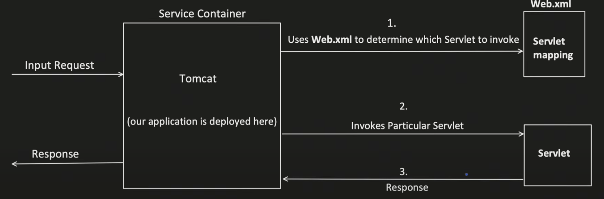
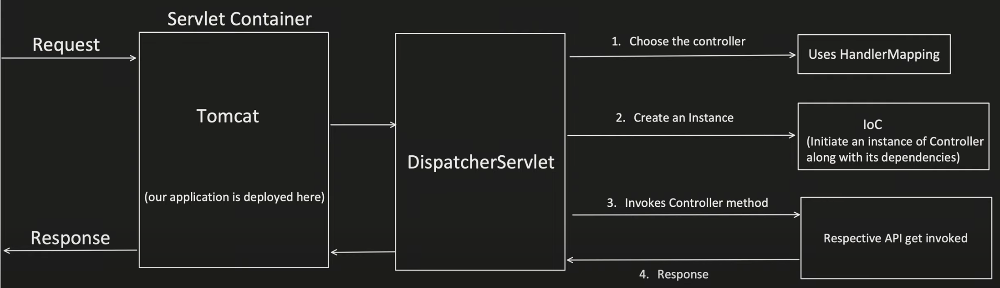
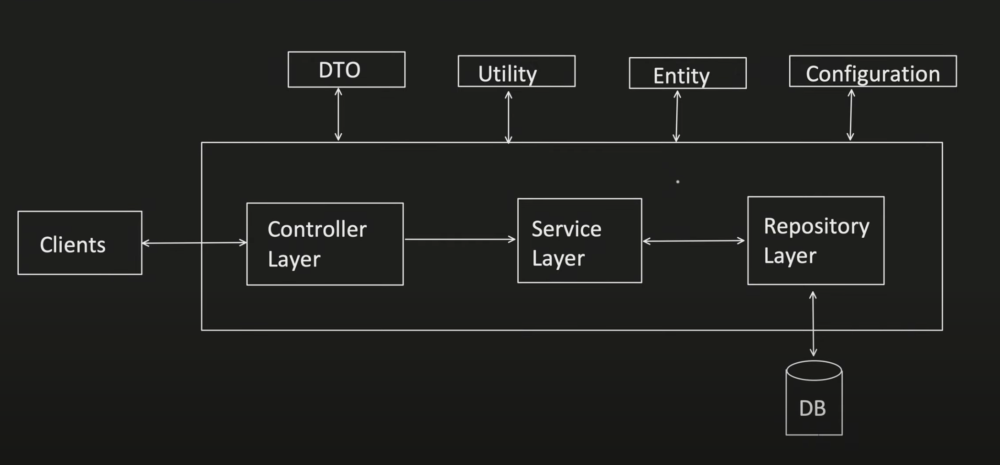
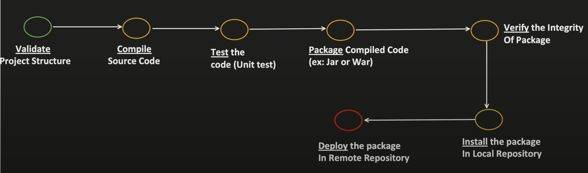
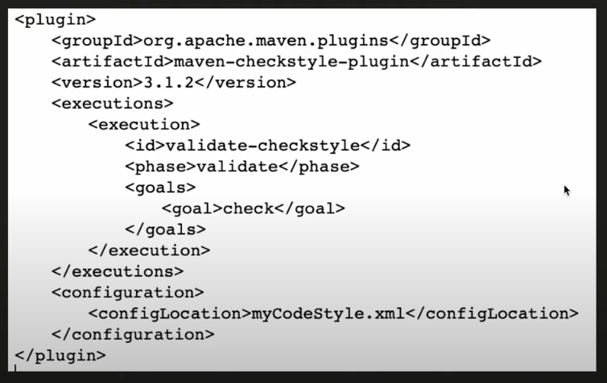
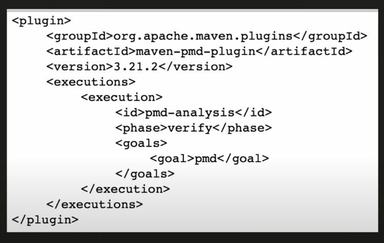
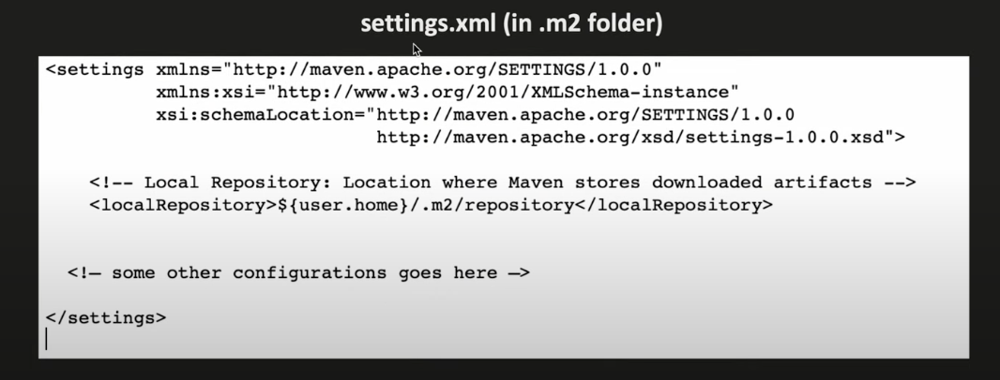
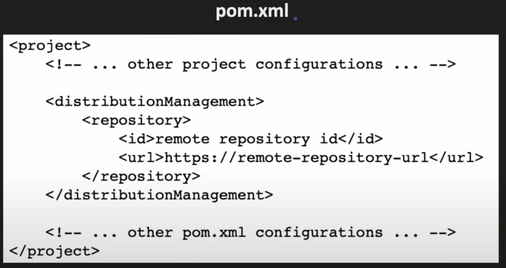
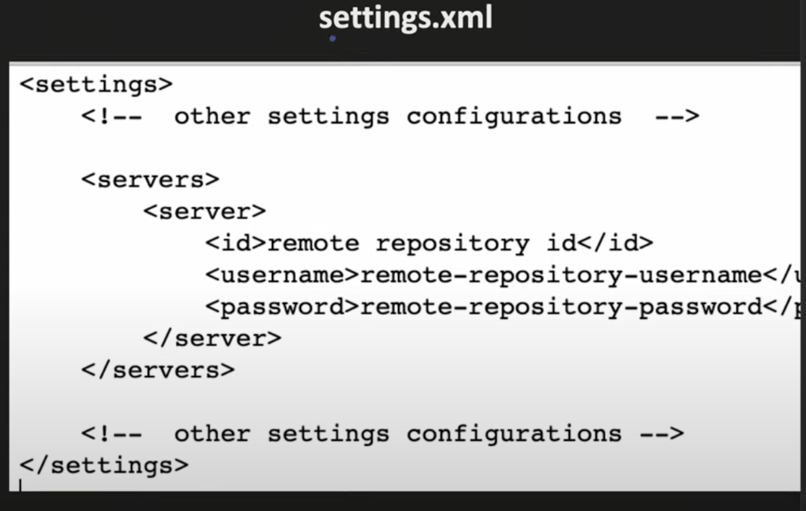

## Servlet and Servlet Container
- provide foundations for building web applications
- servlet is a java class, which handles client request, process it and return the response
- and servlet container are the ones which manages the servlets

Spring framework solve challenges which exists with Servlets
- Removal of web.xml
    - the web.xml overtime becomes too big and becomes very difficult to manage and understand
    - Spring framework introduced annotations based configurations

- Inversion of Control(IOC)
    - Servlets depends on servlet container to create object and maintain its lifecycle
    - IOC is more flexible way to manage object dependencies and its lifecyle(through dependency injection)
    - Dependency Injection is the implementation of IOC

    User class: <a href="inversion_of_control/User.java">User.java</a> 
    Payment class: <a href="inversion_of_control/Payment.java">Payment.java</a>

    Payment class is creating an instance of User class and there is one Major problems with this and i.e. Tight Coupling, payment class is tightly coupled with User class

    How? 
    -> Suppose I want to write Unit test cases for Payment "getSenderDetails()" method but now I cannot easily mock "User" object as Payment class is creating new object of User, so it will invoke the method of User class too

    @Component -> tells Spring that you have to manage this class or bean 
    @Autowired -> tells spring to resolve and add this object dependency

- Unit Testing is much harder
    - As the object creation depends on the Servlet, mocking is not easy, which makes unit testing harder
    - Spring dependency injection facility makes the unit testing very easy

- Difficult to manage REST APIs
    - Handling different HTTP methods, request parameters, path mapping make code little difficult to understand
    - Spring MVC provides an organised pproach to handle the requests and its easy to build RESTful APIs

- Integration with other technologies
    - like hibernate, adding security etc.

## Spring framework

Spring boot solve challenges which exists with Spring MVC
- Dependency Management: No need for adding different dependencies separately and also their compatible version headache
- AutoConfiguration: No need for separately configuring "DispatcherServlet", "AppConfig", "EnableWebMvc", "ComponentScan". Springboot add internally by-default
- Embedded Server: In traditional Spring MVC application, we need to build WAR file which is a packaged file containing application's classes, JSP Pages, configuration files and dependencies. Then we need to deploy this WAR file to servlet container like Tomcat. But in Springboot, Servlet container is already embedded, we don't have to do all this stuff, just run the application that's all.

So what's Springboot?
- It provides a quick way to create a production ready application.
- It is based on Spring framework
- It supports Convention over Configuration
    - Use default values for configuration and if developer do not want to go with the convention, they can override it.
- It also helps to run an application as quick as possible

## Layered Architecture

### DTO(Data Transfer Object)
- Request DTO
    - map the data coming from the client to request dto
    - controller layer takes the responsibility to do the mapping
- Response DTO
    - map the data coming from the db/repository to request dto
    - service layer takes the responsibility to do the mapping

### Utitlity
Anything common across any layers

### Entity
- Entity are classes that are direct representation of our tables
- Used by repository mostly

### Configuration
- application.properties to define fixed values

## Maven
- Maven is a project management tool which helps developer with:
- build generation
- dependency resolution
- documentation

- Maven uses POM(Project Object Model) to achieve this
- When "maven" command is given, it looks for "pom.xml" in the current directory & gets the needed configuration

Maven commands:
- mvn install
- mvn deploy etc.

Ant was previosuly used
- what to do how to do

maven
- what to do, how will be taken care by maven

Maven Project Structure 

learnspringboot
- pom.xml
- src
    - main
        - java
            - com
                - company_name
                    - app_name
                        - Application.java
    - test
        - java
            - com
                - company_name
                    - app_name
                        - ApplicationTest.java

- schemaLocation: specifies the XML schema, also make sure that our XML adheres to correct structure and version defined by maven
- Parent: used to define the parent project. Current Project is a child of spring-boot-starter-parent which might be a child of superpom
    - In maven, each pom.xml is a child of parent pom
    - If this <parent> field is not specified, maen by-default inherit the configurations from "Super Pom". This is the link of maven Super POM: <a href="https://maven.apache.org/ref/3.0.4/maven-model-builder/super-pom.html">super-pom</a>
- group id, artifact id: unique identifier of your project
- properties: key value pair for configurations, and these properties can be used throughout xml file
- repositories: this is where maven look for project dependencies and download the artifacts(jars)
    - urls: url from where you want to download the dependencies
- dependencies: this is where we declare the dependecnies that our project relies on
- build: 

## Maven Lifecycle

- if you want to run "package" all its previous phased will gte executed first
- and if you want to run specified goal of a particular phase, then all the goals of previous phases + current phase goals before the one you defined will get run
- if you want to add a specific task in a specific phase, maven provides the flexibility to add it

## Adding a new task to a specific phase

### Compile:
- mvn compile 
It will validate and compile your code and put it under ${project.basedir}/target/classes

### Test
- mvn test 
It will validate compile and then run TEST cases in your projects

### Package
- mvn package 
First complete, validate, compile, test phase, and then run package phase in which it generates .java or .war file
- puts inside target folder

### Verify
- mvn verify 
It can perform some additional checks apart from unit tests like:
- Static Code Analysis:
    - finds unused variables
    - finds unused imports
    - empty catch block
    - no usage of object
    - finds duplicate code etc.
- CheckSum Verification

Static Code Analysis: pmd has all the supports for that

### install
- mvn install 
install the .jar file in the local maven repository which is typically in your user home directory(windows) or ~/.m2/repository
- this path can be configured using settings.xml in .m2 folder

- while downloading dependencies, it will check the local repository, if it is present, else it will check in the remote repository
- remote repository can be your organisation remore repo else maven central

### Deploy
- mvn deploy 
- it will deploy the .jar file to REMOTE repository

Maven Central Repository: <a href="https://repo.maven.apache.org/maven2">https://repo.maven.apache.org/maven2</a>

Since its public, we do not need username and password in setting.xml