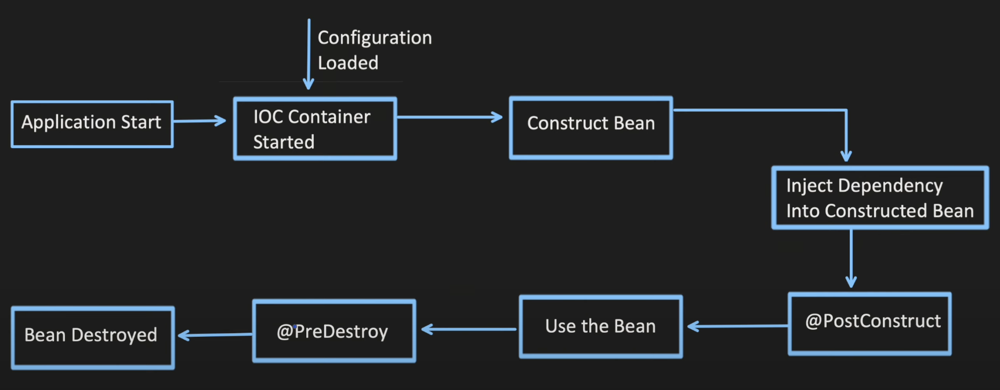

# Bean
In simple term bean is a java object which is managed by spring container(IOC container)

IOC Container -> contains all the beans which gets created and manages them

## How to create a bean
- @Component
- @Bean

## @component annotation
- @component follows convention over configuration approach
- Means spring boot will try to auto configure based on conventions reducing the need for explicit configuration
- @Contoller, @Service all internally tells spring to create bean and manage it

## How springboot find these beans
- @Congiguration
- @ComponentScan

## Lifecycle of a bean
